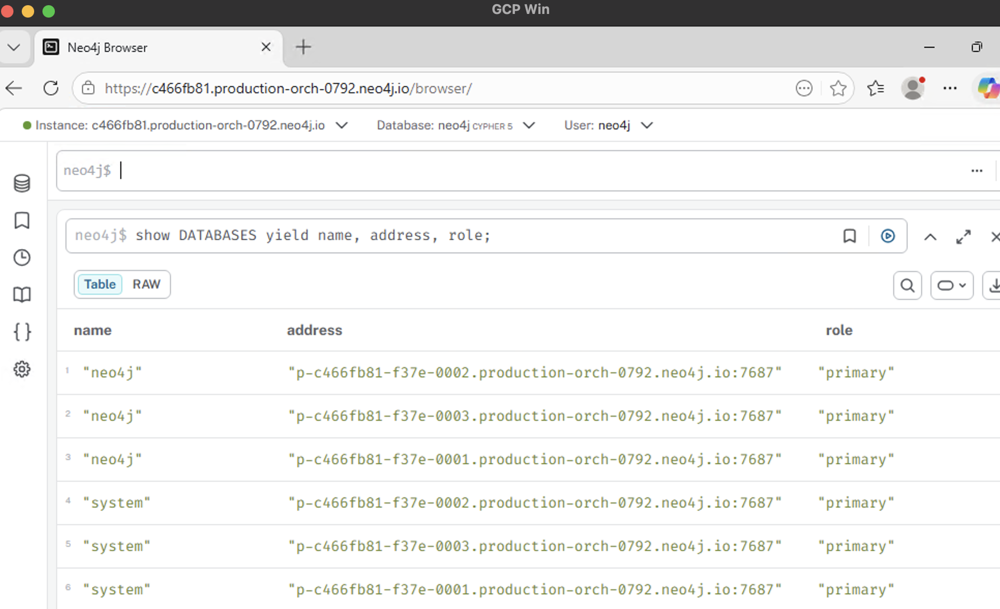

# Neo4j Aura on GCP over Private Service Connect (PSC)

Production-grade Terraform that connects a consumer GCP VPC to a Neo4j
Aura VDC instance entirely over Google's private backbone. No public
internet traversal, no NAT, no VPN.

Based on the official Neo4j Aura guidance at
<https://neo4j.com/docs/aura/security/secure-connections/>. Aura refers to
the GCP PSC service attachment URI as the **Private Link service name**
in the console; the two terms are equivalent.

---

## What you'll build

```
          Consumer project (us-central1)               Producer project (us-central1)
          +---------------------------------+          +------------------------------+
          | Existing "default" VPC          |   PSC    | Neo4j Aura VDC               |
          |  +---------------------------+  |  (GCP    |  +------------------------+  |
          |  | default subnet            |  | backbone)|  | Service attachment     |  |
          |  |                           |  | <======> |  | db-ingress-private     |  |
          |  |  PSC endpoint 10.128.0.50 |  |          |  |                        |  |
          |  |  Windows test VM          |  |          |  +------------------------+  |
          |  +---------------------------+  |          +------------------------------+
          |                                 |
          |  Cloud DNS response policy      |
          |  *.production-orch-NNNN.neo4j.io|
          |      -> 10.128.0.50             |
          +---------------------------------+
```

Two sides, two operators:

| Side              | Who does it                  | What it does                                                                           |
| ----------------- | ---------------------------- | -------------------------------------------------------------------------------------- |
| Producer (Aura)   | You, in the Aura Console     | Exposes the service attachment, allowlists consumer projects, disables public access   |
| Consumer (GCP)    | Terraform in this repo       | Creates PSC endpoint, Cloud DNS override, and an optional Windows test VM              |

**Five resources** land in the consumer project: a static internal IP, a
PSC forwarding rule, a Cloud DNS response policy, and two response-policy
rules (apex and wildcard). Plus the optional Windows VM when `enable_test_vm = true`.

---

## Before you begin

### Prerequisites

- `gcloud` CLI, authenticated with `gcloud auth application-default login`
- `terraform >= 1.5`
- A running **Neo4j Aura VDC** instance
- A **consumer GCP project** with the IAM permissions listed below
- A Windows RDP client (Microsoft Remote Desktop on macOS, `mstsc` on Windows)

### IAM on the consumer project

The identity running Terraform needs at minimum:

- `roles/compute.networkAdmin` (addresses, forwarding rules, firewall if `create_network = true`)
- `roles/compute.instanceAdmin.v1` (test VM)
- `roles/dns.admin` (response policy and rules)
- `roles/iam.serviceAccountUser` (attach the default compute SA to the VM)
- `roles/iap.tunnelResourceAccessor` (for users who RDP via IAP)

---

## Step 1: Allowlist your consumer project in the Aura Console

In the Aura Console, open **your instance > Network access configuration >
Edit**. In step 1 of 3, under **Target GCP Project ID's**, add your
consumer GCP project ID and click **Add project ID**.


Complete steps 2 and 3 of the wizard (region and review).

**Critical**: the string you enter here must match the `consumer_project_id`
you'll set in `terraform.tfvars` in step 3. Aura matches the inbound PSC
connection against this allowlist; if the strings don't match, the
connection stays `PENDING` indefinitely.

Now go to your instance tile and note two values for later:

1. **Private Link service name** (the PSC service attachment URI). Format:
   ```
   https://www.googleapis.com/compute/v1/projects/<aura-project>/regions/<region>/serviceAttachments/<name>
   ```
2. **Orchestrator subdomain** from the Private URI `<dbid>.production-orch-NNNN.neo4j.io`.
   You want the middle segment, for example `production-orch-0792`.

---

## Step 2: Install Terraform

If you already have `terraform >= 1.5` skip this step.

**macOS (Apple Silicon), direct binary install, no Homebrew:**

```bash
VERSION=1.14.9
cd /tmp
curl -fsSL -O https://releases.hashicorp.com/terraform/${VERSION}/terraform_${VERSION}_darwin_arm64.zip
curl -fsSL -O https://releases.hashicorp.com/terraform/${VERSION}/terraform_${VERSION}_SHA256SUMS
shasum -a 256 -c --ignore-missing terraform_${VERSION}_SHA256SUMS
unzip -q terraform_${VERSION}_darwin_arm64.zip
mkdir -p ~/.local/bin && mv terraform ~/.local/bin/
# Ensure ~/.local/bin is on your PATH, then:
terraform version
```

Replace `darwin_arm64` with `darwin_amd64` (Intel Mac) or `linux_amd64` as needed.

---

## Step 3: Clone and configure

```bash
git clone https://github.com/neo4j-field/neo4j-aura-gcp-psc.git
cd neo4j-aura-gcp-psc
cp terraform.tfvars.example terraform.tfvars
```

Edit `terraform.tfvars`. The two lines you **must** set are:

```hcl
consumer_project_id      = "<your consumer GCP project ID>"
neo4j_service_attachment = "<Private Link service name from step 1>"
neo4j_orch_subdomain     = "<orchestrator subdomain from step 1>"
```

The common knobs you may want to change:

```hcl
consumer_region = "us-central1"       # match the Aura producer region to avoid Premium Tier
consumer_zone   = "us-central1-a"

# Use the project's existing "default" VPC rather than creating a new one.
# Safe default for demo/test. For hardened deployments set create_network = true.
create_network        = false
existing_network_name = "default"
existing_subnet_name  = "default"

enable_test_vm      = true            # create a Windows Server 2022 test VM
enable_vm_public_ip = true            # attach an ephemeral external IP for direct RDP
```

---

## Step 4: Init, plan, apply

```bash
terraform init
terraform plan -out=tfplan.binary
terraform apply tfplan.binary
```

Expected run time: ~30 seconds. Key outputs to watch for after apply:

```
psc_endpoint_ip          = "10.128.0.50"
psc_connection_status    = "ACCEPTED"
psc_forwarding_rule_id   = "projects/<project>/regions/us-central1/forwardingRules/neo4j-psc-endpoint"
dns_wildcard_name        = "*.production-orch-NNNN.neo4j.io."
windows_vm_name          = "neo4j-test-vm-win"
windows_vm_zone          = "us-central1-a"
iap_rdp_command          = "gcloud compute start-iap-tunnel ..."
```

If `psc_connection_status` shows `PENDING`, re-check step 1: the project ID
in the Aura allowlist must match `consumer_project_id` exactly.

---

## Step 5: RDP into the Windows test VM

Two paths depending on your `enable_vm_public_ip` choice.

### 5a. With public IP (direct RDP)

Reset the Windows password:

```bash
gcloud compute reset-windows-password neo4j-test-vm-win \
  --zone=us-central1-a --project=<your project>
```

Grab the VM's external IP:

```bash
terraform output windows_vm_public_ip
```

Open your RDP client and connect to `<external-ip>:3389` with the
username/password from the reset command.

### 5b. Via IAP tunnel (no public IP)

Start the tunnel (keep this terminal open):

```bash
$(terraform output -raw iap_rdp_command)
```

That listens on `localhost:13389`. Point your RDP client at
`localhost:13389` with the password from `gcloud compute reset-windows-password`.

---

## Step 6: Validate the PSC private path

On the Windows VM, open PowerShell and paste this one-liner (substitute
your own `$h` with the private URI and `$ip` with `psc_endpoint_ip`):

```powershell
$h="<dbid>.production-orch-NNNN.neo4j.io"; $ip="10.128.0.50"; $dns=(Resolve-DnsName $h -Type A -ErrorAction SilentlyContinue).IPAddress; Write-Host "Host       : $h"; Write-Host "Expected IP: $ip"; Write-Host "DNS answer : $dns"; if ($dns -eq $ip) { Write-Host "DNS PASS" -ForegroundColor Green } else { Write-Host "DNS FAIL" -ForegroundColor Red }; 443,7687,7474,8491 | ForEach-Object { $r=Test-NetConnection -ComputerName $h -Port $_ -WarningAction SilentlyContinue; $s = if ($r.TcpTestSucceeded) { "PASS" } else { "FAIL" }; Write-Host ("TCP {0,-5}: {1}" -f $_, $s) }
```

Expected:

```
Host       : <dbid>.production-orch-NNNN.neo4j.io
Expected IP: 10.128.0.50
DNS answer : 10.128.0.50
DNS PASS
TCP 443  : PASS
TCP 7687 : PASS
TCP 7474 : PASS
TCP 8491 : PASS      (or FAIL if GDS isn't enabled; fine)
```

Port 8491 is only used by Graph Analytics (GDS); a FAIL there is not a blocker.

For a more reusable script, run `scripts/validate.ps1` on the VM with
explicit parameters. Copy it onto the VM with `gcloud compute scp` over IAP:

```bash
gcloud compute scp scripts/validate.ps1 \
  neo4j-test-vm-win:C:\Users\Public\validate.ps1 \
  --tunnel-through-iap --zone=us-central1-a --project=<your project>
```

Then on the VM:

```powershell
C:\Users\Public\validate.ps1 -Neo4jHost "<dbid>.production-orch-NNNN.neo4j.io" -ExpectedPscIp "10.128.0.50"
```

---

## Step 7: Connect to Neo4j over the private URI

On the Windows VM, open Edge or Chrome and navigate to:

```
https://<dbid>.production-orch-NNNN.neo4j.io/browser/
```

Neo4j Browser loads. In the Connect to instance dialog:

- Protocol: `neo4j+s://`
- Connection URL: `<dbid>.production-orch-NNNN.neo4j.io`
- Database user: `neo4j`
- Password: from the Aura credentials file you downloaded when you created the instance


Use the **Private URI**, not the public one (`<dbid>.databases.neo4j.io`) —
the public URI resolves via public DNS and bypasses PSC.

Once connected, run:

```cypher
SHOW DATABASES YIELD name, address, role;
```

You should see the cluster's internal node addresses. These resolve
through the wildcard DNS rule (`*.production-orch-NNNN.neo4j.io.`) to
the PSC endpoint IP, confirming end-to-end routing traverses the private
backbone:



Each `p-<dbid>-<shard>.production-orch-NNNN.neo4j.io:7687` address
traffic flows through PSC, not the public internet.

---

## Step 8: (Recommended) Disable public access

Only after step 7 succeeds, return to the Aura Console and toggle
**Disable Public Access** on the instance. This forces all traffic
through PSC and is the final hardening step.

If you disable public access before step 7 passes you will lose access
to the instance from anywhere outside the consumer VPC. Re-enable it
from the console if that happens.

---

## Troubleshooting

| Symptom                                            | Likely cause and fix                                                                                            |
| -------------------------------------------------- | --------------------------------------------------------------------------------------------------------------- |
| `psc_connection_status` stuck on `PENDING`         | Consumer project ID mismatch in Aura's **Target GCP Project ID's** allowlist. Re-check step 1.                  |
| DNS resolves to a public IP on the Windows VM      | Response policy not attached to the VM's VPC, or trailing dot missing on `dns_name`. The provided module handles both. |
| `Test-NetConnection` on 7687 fails, DNS is correct | Connection not yet `ACCEPTED`, or Premium Tier not enabled for a cross-region setup.                            |
| `terraform apply` fails on the forwarding rule     | Service attachment URI is wrong, region mismatched, or consumer project not yet on the Aura allowlist.          |
| RDP tunnel fails with `permission denied`          | Missing `roles/iap.tunnelResourceAccessor` on the user.                                                         |
| Lost access after disabling public access          | Enable it again from the Aura Console, re-run step 6 to validate the private path, then disable.                |
| Neo4j Browser: certificate hostname mismatch       | You connected to the public URI. Use the **Private URI** `<dbid>.production-orch-NNNN.neo4j.io`.                |

---

## Clean up

```bash
terraform destroy
```

The Aura side of the connection is not managed by Terraform. Remove the
consumer project from the Aura allowlist in the console (or simply
rotate it out) to finish tear-down.

---

## Reference

### Module layout

```
neo4j-aura-gcp-psc/
├── main.tf                      wires modules together
├── variables.tf                 root input variables
├── outputs.tf                   root outputs (including next_steps)
├── terraform.tfvars.example     copy to terraform.tfvars and fill in
├── modules/
│   ├── networking/              VPC + subnet + firewall, or data-source lookup
│   ├── psc_endpoint/            static IP + PSC forwarding rule
│   ├── dns/                     response policy + apex and wildcard A records
│   └── test_vm/                 Windows Server 2022 VM, Shielded VM
├── scripts/
│   ├── validate.ps1             run on the Windows VM to verify connectivity
│   └── iap_rdp.sh               start an IAP RDP tunnel to the test VM
├── prompts/                     design brief, iteration notes, final spec
└── screenshots/                 images referenced in this guide
```

### Ports

| Port | Purpose                        |
| ---- | ------------------------------ |
| 443  | HTTPS (Aura APIs, Browser UI)  |
| 7687 | Bolt (drivers)                 |
| 7474 | Browser HTTP listener          |
| 8491 | Graph Analytics (GDS)          |

### Design choices

- **Two DNS rules (apex + wildcard).** The Aura public docs specify a
  wildcard; the in-console instructions use the apex. Cloud DNS response
  policy rules do not perform subtree matching, so we create both.
- **Reuse the default VPC by default.** Simpler blast radius for a first
  deployment. For production, set `create_network = true` and tighten
  firewall rules.
- **Static internal IP for the PSC endpoint.** The IP is the DNS answer;
  reserving it keeps the DNS record stable across forwarding rule
  recreations.
- **Shielded VM on the test instance.** Secure boot, vTPM, and integrity
  monitoring are on by default.
- **`enable_test_vm` and `enable_vm_public_ip` flags.** Keep the test
  surface out of production, and force IAP-only access where needed.

### Related docs

- [Neo4j Aura: Secure Connections](https://neo4j.com/docs/aura/security/secure-connections/)
- [GCP: Access published services through Private Service Connect](https://cloud.google.com/vpc/docs/configure-private-service-connect-services)
- [GCP: Cloud DNS response policies](https://cloud.google.com/dns/docs/zones/manage-response-policies)
