# Neo4j Aura on GCP over Private Service Connect (PSC)

Production-grade Terraform that connects a consumer GCP VPC to a Neo4j
Aura VDC instance entirely over Google's private backbone. No public
internet traversal, no NAT, no VPN.

Based on the official Neo4j Aura guidance at
<https://neo4j.com/docs/aura/security/secure-connections/>. Aura refers to
the GCP PSC service attachment URI as the **Private Link service name**
in the console; the two terms are equivalent.

---

## What you'll build

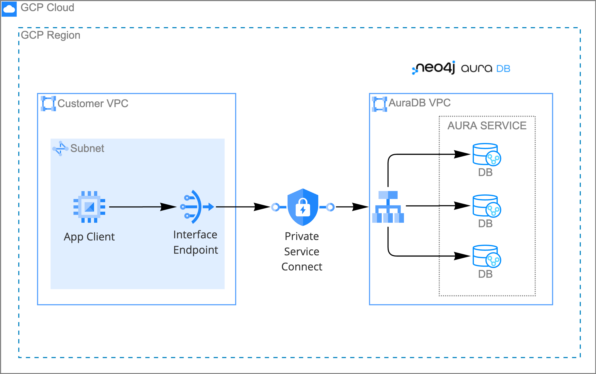

A consumer VPC carries an Interface Endpoint that forwards traffic
through Private Service Connect to the AuraDB VPC, where Aura routes
to individual cluster nodes.

Two sides, two operators:

| Side              | Who does it                  | What it does                                                                           |
| ----------------- | ---------------------------- | -------------------------------------------------------------------------------------- |
| Producer (Aura)   | You, in the Aura Console     | Exposes the service attachment, allowlists consumer projects, disables public access   |
| Consumer (GCP)    | Terraform in this repo       | Creates PSC endpoint, Cloud DNS override, and an optional Windows test VM              |

**Five resources** land in the consumer project: a static internal IP, a
PSC forwarding rule, a Cloud DNS response policy, and two response-policy
rules (apex and wildcard). Plus the optional Windows VM when `enable_test_vm = true`.

---

## Before you begin

### Prerequisites

- `gcloud` CLI, authenticated with `gcloud auth application-default login`
- `terraform >= 1.5`
- A running **Neo4j Aura VDC** instance
- A **consumer GCP project** with the IAM permissions listed below
- A Windows RDP client (Microsoft Remote Desktop on macOS, `mstsc` on Windows)

### IAM on the consumer project

The identity running Terraform needs at minimum:

- `roles/compute.networkAdmin` (addresses, forwarding rules, firewall if `create_network = true`)
- `roles/compute.instanceAdmin.v1` (test VM)
- `roles/dns.admin` (response policy and rules)
- `roles/iam.serviceAccountUser` (attach the default compute SA to the VM)
- `roles/iap.tunnelResourceAccessor` (for users who RDP via IAP)
- `roles/networkmanagement.admin` (Connectivity Tests in step 6, optional)

---

## Step 1: Identify (or create) your consumer GCP project

Before opening the Aura Console, settle on exactly which GCP project
will host the consumer side of this setup (the PSC endpoint, the Cloud
DNS response policy, and the optional test VM). Every downstream step
keys off this project's **ID**, so pinning it down first avoids the
most common failure mode: `psc_connection_status` stuck on `PENDING`
because the string in the Aura allowlist and the string in
`terraform.tfvars` disagree by a single character.

### 1.1 Open the GCP Console project picker

Sign in to <https://console.cloud.google.com> and click the project
picker in the top bar. A selector opens listing every project, folder,
and organization you have access to.

### 1.2 Copy the project **ID** (not the Name)

The **ID** column is the value you want. The **Name** column is for
humans; the **ID** is what both GCP and Aura use internally, and the
two are often different (for example, Name `Neo4j Aura PSC Demo` with
ID `neo4j-aura-psc-demo-12345`).

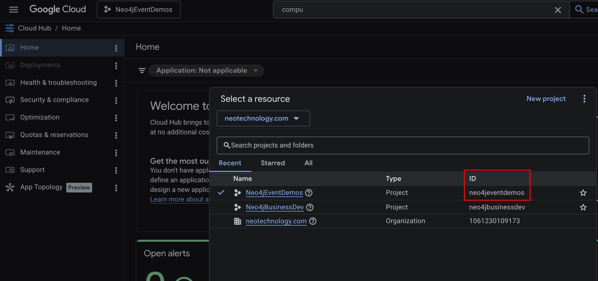

Save that ID somewhere. You will paste it in two places, and the two
strings must match exactly, character for character:

- Into the Aura network access wizard's **Target GCP Project ID's**
  field (Step 2 of this guide).
- Into `terraform.tfvars` as `consumer_project_id` (Step 4 of this
  guide).

### 1.3 Don't have a project yet? Create one

Either click **New Project** in the same picker, or from the command
line:

```bash
gcloud projects create <your-project-id> \
  --name="<Human-readable name>" \
  --set-as-default
```

Project IDs are globally unique, lowercase, and immutable once
created. Pick something descriptive (`neo4j-aura-psc-prod`, not
`test-123`): it will appear in every log line, IAM binding, and
billing export for the life of the project. If the project lives
under an organization or folder, pass `--organization=<id>` or
`--folder=<id>`, and make sure billing is linked:

```bash
gcloud billing projects link <your-project-id> \
  --billing-account=<billing-account-id>
```

### 1.4 Enable the APIs Terraform will call

Turn these on up front so the first `terraform apply` doesn't stop
mid-run to prompt for an API that isn't enabled:

```bash
gcloud services enable \
  compute.googleapis.com \
  dns.googleapis.com \
  iap.googleapis.com \
  iamcredentials.googleapis.com \
  servicenetworking.googleapis.com \
  --project=<your-project-id>
```

### 1.5 Authenticate your local `gcloud` against this project

Point both the interactive `gcloud` CLI and Terraform's Application
Default Credentials at the project:

```bash
gcloud auth login
gcloud config set project <your-project-id>
gcloud auth application-default login
```

The identity you authenticate as must have the roles listed in
[IAM on the consumer project](#iam-on-the-consumer-project) above.
On a shared project, have your project admin grant them before
continuing.

---

## Step 2: Allowlist your consumer project and collect Terraform inputs

The Aura Console's network access wizard is three steps. Step 1
allowlists your consumer project (you'll paste the ID you copied in
Step 1 of this guide), step 2 hands you the two values Terraform
needs, step 3 disables public traffic (which you'll do later, after
you've validated the private path).

### 2.1 Open the network access wizard

From the Aura Console (<https://console.neo4j.io>), open the left
navigation, expand **Project**, and click **Settings**:

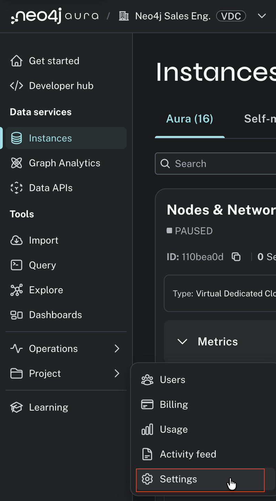

On the Project settings page, find the **Private endpoints** tile
("Configure network access to your instance") and click it:

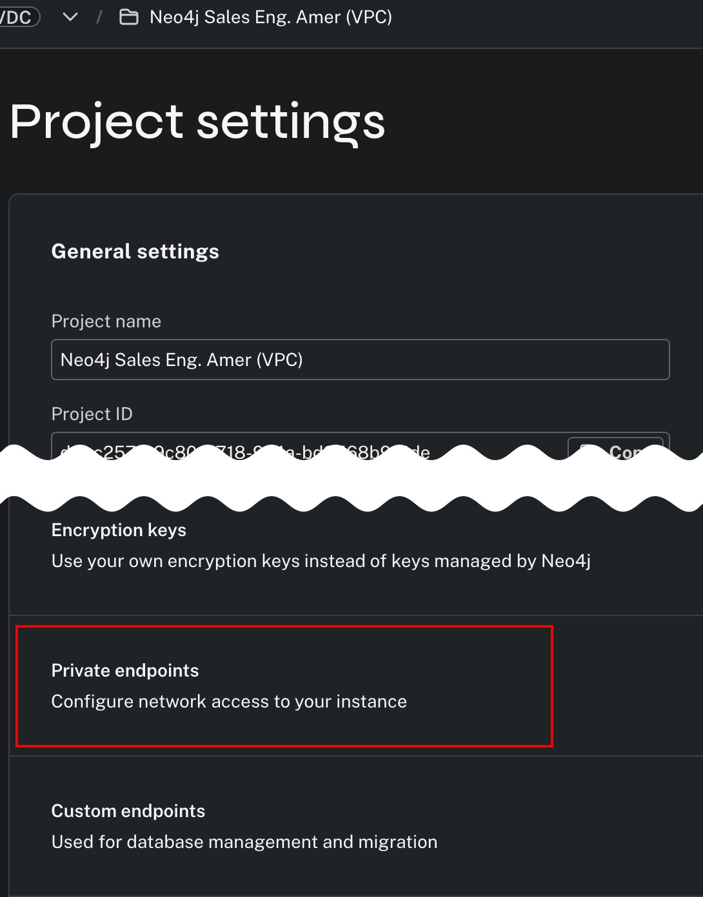

That opens the three-step **Edit network access configuration** wizard.

### 2.2 Wizard Step 1 of 3: Target GCP Project ID's

- **Instance Type**: pick the type of the instance you are securing
  (AuraDB Professional, Enterprise, Business Critical, and so on).
- **Target GCP Project ID's**: click **Add project ID** and paste the
  GCP project ID you captured in [Step 1.2](#12-copy-the-project-id-not-the-name).

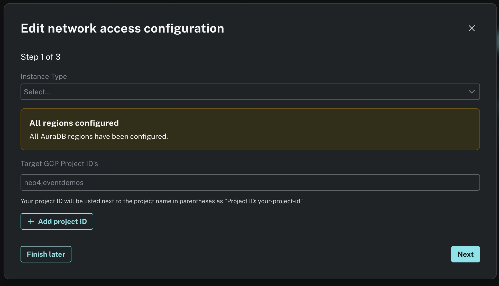

**Critical**: the string you paste here must match the
`consumer_project_id` you'll set in `terraform.tfvars` in Step 4,
exactly. If the strings differ, Terraform will create the forwarding
rule but `psc_connection_status` will stay on `PENDING`. That's
precisely why Step 1 has you copy the ID from the GCP Console project
picker rather than retyping it from memory.

Click **Next**.

### 2.3 Wizard Step 2 of 3: Copy the Service Attachment URL and DNS Name

Step 2 is where Aura hands you the two identifiers Terraform needs.
At the top of the page, a green **Accepted** badge confirms your
project allowlist is saved. Below it is the **Service Attachment URL**
with a **Copy** button:

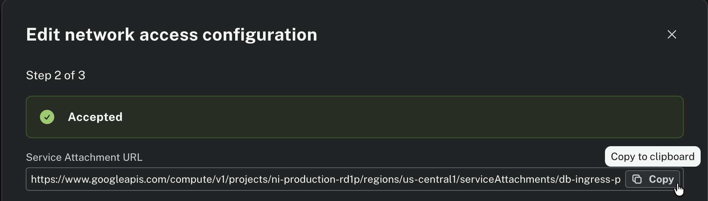

Click **Copy** and save the value somewhere. This is your
`neo4j_service_attachment` for `terraform.tfvars`. A concrete example
for a `us-central1` instance looks like
`https://www.googleapis.com/compute/v1/projects/ni-production-rd1p/regions/us-central1/serviceAttachments/db-ingress-private`.

Scroll down on the same wizard page. Aura prints the GCP-side
instructions for creating a PSC endpoint and DNS rule manually. You
will not follow those steps by hand because Terraform does them for
you, but one value from that section is useful: the **DNS Name**, for
example `production-orch-0792.neo4j.io.`:

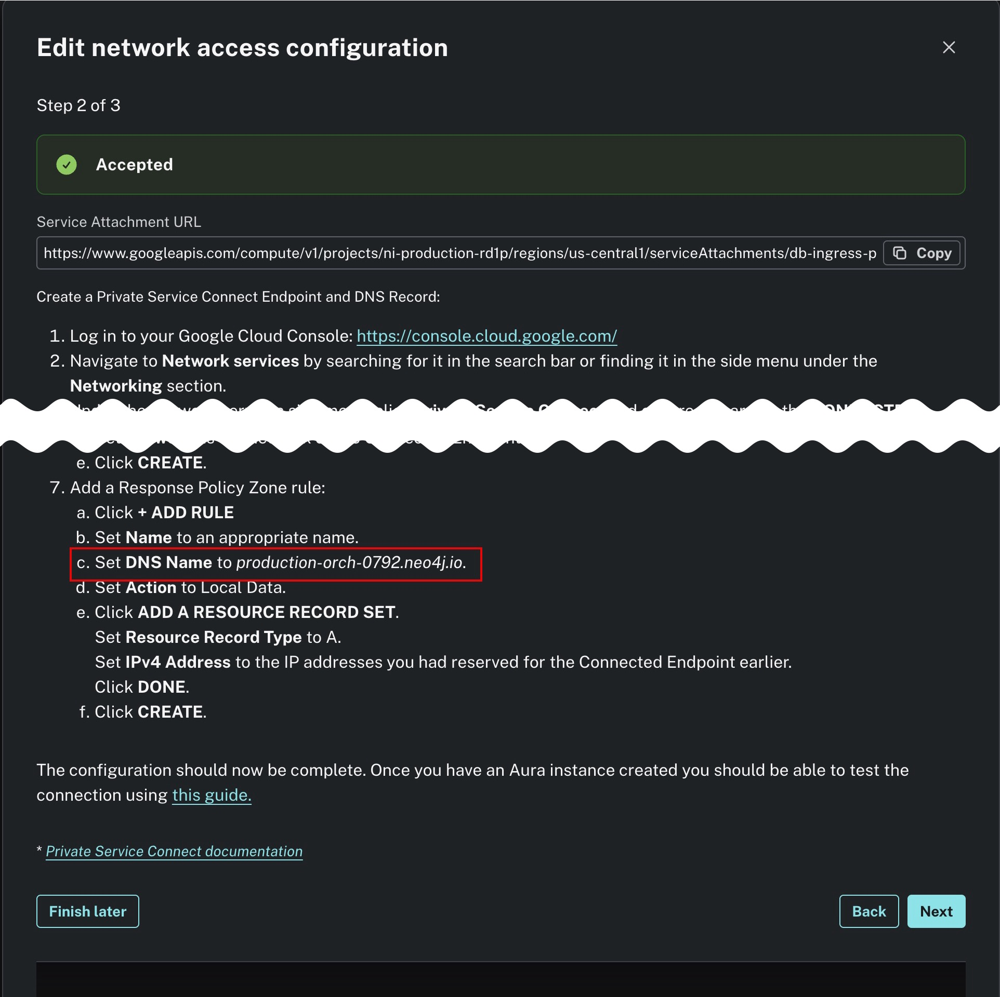

That DNS Name's middle segment (`production-orch-0792`) is your
`neo4j_orch_subdomain` for `terraform.tfvars`. Do not include the
leading wildcard or the trailing dot; Terraform adds those.

### 2.4 Wizard Step 3 of 3: Pause here

Click **Next** to preview Step 3. It looks like this:

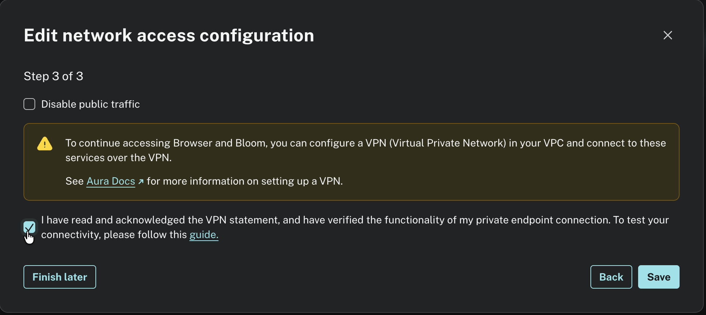

**Do not check "Disable public traffic" yet.** You will come back to
this screen in the final step of this guide, after validating the
private path. For now, click **Finish later** (bottom-left) to save
your progress and exit the wizard.

### 2.5 What you should have now

Three values, one per Terraform variable:

| What                      | Where it came from                                                          | Terraform variable         |
| ------------------------- | --------------------------------------------------------------------------- | -------------------------- |
| Consumer GCP project ID   | GCP Console project picker (Step 1.2, screenshot 04)                        | `consumer_project_id`      |
| Service Attachment URL    | Copy button on Aura wizard Step 2 of 3 (Step 2.3, screenshot 05)            | `neo4j_service_attachment` |
| Orchestrator subdomain    | Middle segment of the DNS Name on Aura wizard Step 2 of 3 (Step 2.3, screenshot 06) | `neo4j_orch_subdomain`     |

---

## Step 3: Install Terraform

First, see whether you already have it:

```bash
terraform version
```

If that prints `Terraform v1.5` or newer, skip ahead. Otherwise pick
your platform below. Each option installs the official HashiCorp
binary straight from <https://releases.hashicorp.com/terraform/> and
does not require a package manager.

### macOS (Apple Silicon, `darwin_arm64`)

```bash
VERSION=1.14.9
cd /tmp
curl -fsSL -O https://releases.hashicorp.com/terraform/${VERSION}/terraform_${VERSION}_darwin_arm64.zip
curl -fsSL -O https://releases.hashicorp.com/terraform/${VERSION}/terraform_${VERSION}_SHA256SUMS
shasum -a 256 -c --ignore-missing terraform_${VERSION}_SHA256SUMS
unzip -q terraform_${VERSION}_darwin_arm64.zip
mkdir -p ~/.local/bin && mv terraform ~/.local/bin/
# Make sure ~/.local/bin is on your PATH, then:
terraform version
```

### macOS (Intel, `darwin_amd64`)

Same commands, but replace every `darwin_arm64` with `darwin_amd64`.

### Linux (`linux_amd64`)

```bash
VERSION=1.14.9
cd /tmp
curl -fsSL -O https://releases.hashicorp.com/terraform/${VERSION}/terraform_${VERSION}_linux_amd64.zip
curl -fsSL -O https://releases.hashicorp.com/terraform/${VERSION}/terraform_${VERSION}_SHA256SUMS
sha256sum --ignore-missing -c terraform_${VERSION}_SHA256SUMS
unzip -q terraform_${VERSION}_linux_amd64.zip
sudo install -m 755 terraform /usr/local/bin/
terraform version
```

For `arm64` Linux, replace `linux_amd64` with `linux_arm64`.

### Windows

The fastest path is `winget`:

```powershell
winget install HashiCorp.Terraform
terraform version
```

For an offline or locked-down environment, download
`terraform_1.14.9_windows_amd64.zip` from
<https://releases.hashicorp.com/terraform/1.14.9/>, unzip to a folder
of your choice (for example `C:\Tools\terraform\`), and add that
folder to your **System Environment Variables > PATH**.

### Verify

Whatever path you took, confirm before moving on:

```bash
terraform version
# Terraform v1.14.9
# on darwin_arm64  (or your OS/arch)
```

---

## Step 4: Clone the repo and configure `terraform.tfvars`

### 3.1 Clone

You will need `git` on your machine (`git --version` to check; if not
installed, grab it from <https://git-scm.com/downloads> or via
your OS package manager).

```bash
git clone https://github.com/neo4j-field/neo4j-aura-gcp-psc.git
cd neo4j-aura-gcp-psc
```

### 3.2 What the template gives you

```
neo4j-aura-gcp-psc/
├── main.tf                       wires the modules together
├── variables.tf                  root input variables
├── outputs.tf                    root outputs (PSC IP, connection status, RDP command)
├── terraform.tfvars.example      copy to terraform.tfvars and fill in
├── modules/
│   ├── networking/               new VPC + firewall, or data-source lookup of an existing one
│   ├── psc_endpoint/             reserved internal IP + PSC forwarding rule
│   ├── dns/                      Cloud DNS response policy + apex and wildcard rules
│   ├── test_vm_linux/            small Debian 12 VM for DNS + TCP validation (default)
│   └── test_vm_windows/          optional Windows Server 2022 VM for Neo4j Browser UI
├── scripts/
│   ├── validate.sh               run on the Linux VM to verify DNS + TCP
│   ├── validate.ps1              run on the Windows VM to verify DNS + TCP
│   ├── iap_ssh.sh                start an IAP SSH session to the Linux VM
│   ├── iap_rdp.sh                start an IAP RDP tunnel to the Windows VM
│   └── local_tunnel.sh           forward Bolt/Browser from laptop through the Linux VM
├── screenshots/                  images embedded in this README
└── prompts/                      design brief and iteration history
```

You will only edit `terraform.tfvars` in a normal setup. Everything in
`modules/` is reusable and driven by the root variables.

### 3.3 Create your variables file

Never commit `terraform.tfvars` (it's already in `.gitignore`). Start
from the example:

```bash
cp terraform.tfvars.example terraform.tfvars
```

Edit `terraform.tfvars`. The three lines you **must** set, using the
values you collected in step 2.5:

```hcl
consumer_project_id      = "<your consumer GCP project ID>"
neo4j_service_attachment = "<Service Attachment URL from step 2.3>"
neo4j_orch_subdomain     = "<orchestrator subdomain from step 2.3>"
```

The common knobs you may want to change:

```hcl
consumer_region = "us-central1"       # match the Aura producer region to avoid Premium Tier
consumer_zone   = "us-central1-a"

# Use the project's existing "default" VPC rather than creating a new one.
# Safe default for demo/test. For hardened deployments set create_network = true.
create_network        = false
existing_network_name = "default"
existing_subnet_name  = "default"

# Linux test VM (default). Tiny Debian 12 e2-micro box for DNS + TCP validation.
enable_linux_test_vm  = true
linux_vm_public_ip    = true          # SSH conveniently; set false for IAP-only

# Windows browser VM (optional). Enable only if you want to click through
# the Neo4j Browser UI over the private URI.
enable_windows_browser_vm = false
windows_vm_public_ip      = false     # IAP RDP is safer than a public 3389
```

> The **Linux** VM is the default testing path: small, cheap, and boots in
> seconds. The **Windows** VM is optional and only makes sense if you want
> to see Neo4j Browser's web UI from inside the VPC. You can enable both
> at once if you want, but most people don't need to.

---

## Step 5: Init, plan, apply

```bash
terraform init
terraform plan -out=tfplan.binary
terraform apply tfplan.binary
```

Expected run time: ~30 seconds (just a minute or two longer if you
enable the Windows browser VM). Key outputs to watch for after apply:

```
psc_endpoint_ip          = "10.128.0.50"
psc_connection_status    = "ACCEPTED"
psc_forwarding_rule_id   = "projects/<project>/regions/us-central1/forwardingRules/neo4j-psc-endpoint"
dns_wildcard_name        = "*.production-orch-NNNN.neo4j.io."
linux_vm_name            = "neo4j-test-vm-linux"
linux_vm_zone            = "us-central1-a"
iap_ssh_command          = "gcloud compute ssh neo4j-test-vm-linux --tunnel-through-iap ..."
```

Confirm the same thing from the GCP Console side: **Network services >
Private Service Connect > Connected endpoints**. The endpoint shows as
**Accepted**:

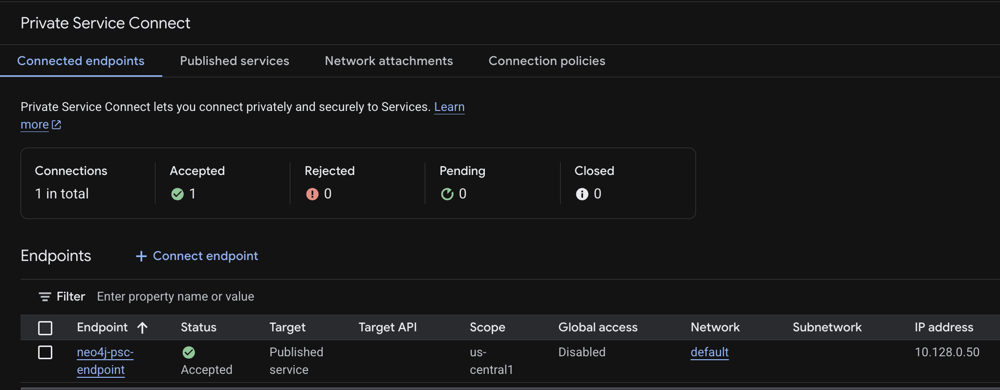

If `psc_connection_status` shows `PENDING`, re-check step 2.2: the
project ID in the Aura allowlist must match `consumer_project_id`
exactly.

---

## Step 6: (Optional) Validate with a GCP Connectivity Test

Before logging into the VM, you can prove the PSC path is reachable
from the GCP side using a Connectivity Test. This exercises the same
forwarding-rule, subnet-route, and firewall-rule hops a real client
traverses, without needing to RDP in.

In the GCP Console, open **Network Intelligence > Connectivity Tests**
and click **Create Connectivity Test**. Fill in:

- **Test name**: `neo4j-psc-endpoint-test`
- **Protocol**: `tcp`
- **Source**: VM instance `neo4j-test-vm-linux` (source IP auto-fills from the VM's NIC)
- **Destination**: PSC endpoint `neo4j-psc-endpoint` (10.128.0.50)
- **Destination port**: `443`

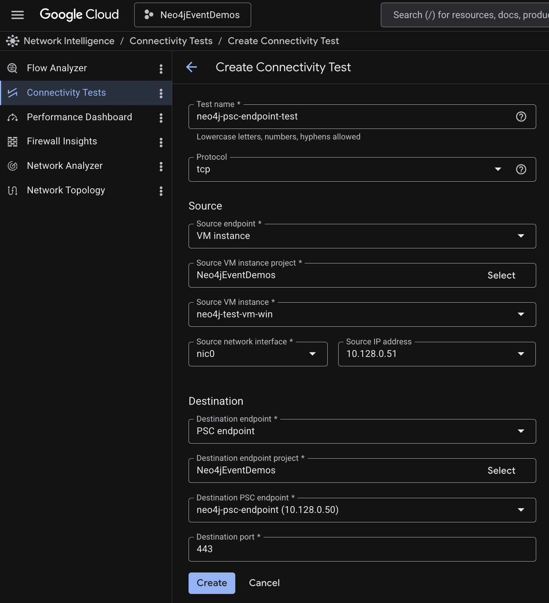

Click **Create**. GCP runs the test and returns a reachability report.
A healthy result looks like 50/50 packets delivered, sub-millisecond
latency, and a green **Reachable** badge on both the forward and return
traces. The forward trace walks through the egress firewall rule, the
subnet route, and the PSC forwarding rule:

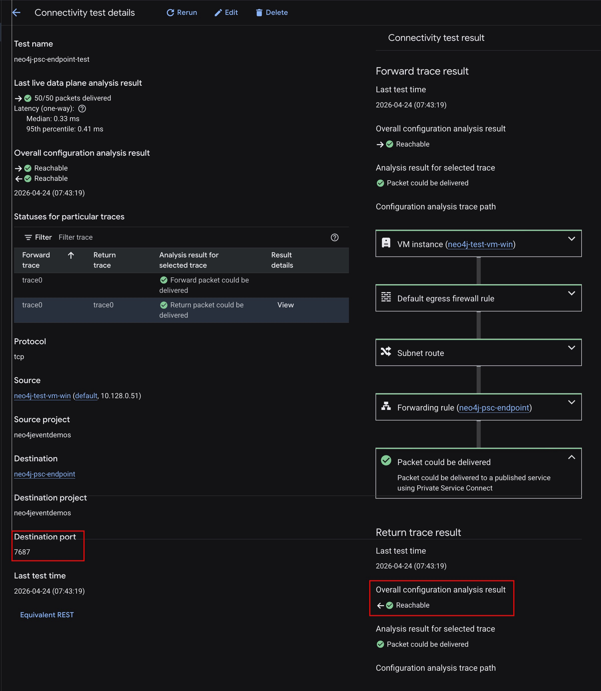

You can repeat this for ports 7687, 7474, and 8491 by editing the
destination port. A failure here points at a routing or firewall issue
and is easier to diagnose than one reported from inside the VM.

---

## Step 7: SSH into the Linux test VM

Use IAP SSH (no public IP needed) through `gcloud`:

```bash
$(terraform output -raw iap_ssh_command)
```

Or if you left `linux_vm_public_ip = true`, SSH directly:

```bash
ssh "$(whoami)@$(terraform output -raw linux_vm_public_ip)"
```

The repo ships a wrapper at `scripts/iap_ssh.sh` that reads values
from `terraform output` and opens the IAP tunnel for you.

> Skipping the Linux VM because you only care about the GCP-side
> Connectivity Test in step 6 is a valid choice. Set `enable_linux_test_vm = false`
> and re-apply.

---

## Step 8: Validate the PSC private path from the VM

From the Linux VM, copy `scripts/validate.sh` across and run it. The
cleanest way is to paste the script inline, but `gcloud compute scp`
works too:

```bash
gcloud compute scp scripts/validate.sh \
  neo4j-test-vm-linux:~/validate.sh \
  --tunnel-through-iap --zone=us-central1-a --project=<your project>

gcloud compute ssh neo4j-test-vm-linux --tunnel-through-iap \
  --zone=us-central1-a --project=<your project> \
  --command='bash ~/validate.sh <dbid>.production-orch-NNNN.neo4j.io 10.128.0.50'
```

The script uses only bash built-ins (`/dev/tcp` for port probes,
`getent` or `dig` for DNS), so no extra packages are required on a
minimal Debian image. Expected output:

```
Neo4j PSC connectivity check
============================
Host       : <dbid>.production-orch-NNNN.neo4j.io
Expected IP: 10.128.0.50
DNS answer : 10.128.0.50
DNS        : PASS
TCP 443  : PASS
TCP 7687 : PASS
TCP 7474 : PASS
TCP 8491 : PASS      (or FAIL if GDS isn't enabled; fine)

RESULT: PASS
```

Exit code 0 on success, 1 on failure. Port 8491 (Graph Analytics) is
treated as optional and does not fail the run.

### Windows alternative

If you chose `enable_windows_browser_vm = true`, run `scripts/validate.ps1`
on the Windows VM instead (PowerShell `Test-NetConnection` and
`Resolve-DnsName`):

```powershell
C:\Users\Public\validate.ps1 -Neo4jHost "<dbid>.production-orch-NNNN.neo4j.io" -ExpectedPscIp "10.128.0.50"
```

### Test from your local desktop through an SSH tunnel

You can also hit the private path from your laptop without a GUI
anywhere, using an SSH tunnel through the Linux VM. The VM resolves
the Aura hostname through the VPC-scoped Cloud DNS response policy,
so from your laptop you are effectively reaching PSC.

The flow:

```
laptop:7687  <-- ssh -L -->  vm  <-- PSC -->  aura:7687
                              ^
                              resolves <host> via the VPC response policy
```

**One-time:** add the Aura private hostname to your laptop's hosts
file so TLS cert validation works. The driver will send SNI for the
Aura hostname, and Aura's wildcard cert covers
`*.production-orch-NNNN.neo4j.io`, so as long as the hostname in the
URI matches the hosts entry, TLS succeeds.

- macOS / Linux: `sudo vi /etc/hosts`
- Windows: open `C:\Windows\System32\drivers\etc\hosts` as Administrator

Add:

```
127.0.0.1  <dbid>.production-orch-NNNN.neo4j.io
```

**Open the tunnel** (from the repo root, where `terraform output` works):

```bash
./scripts/local_tunnel.sh <dbid>.production-orch-NNNN.neo4j.io
```

This forwards local `7687` → Bolt and local `7474` → Browser HTTP
through the Linux VM. Leave it running.

**In a second terminal, connect with cypher-shell:**

```bash
cypher-shell -a neo4j+s://<dbid>.production-orch-NNNN.neo4j.io:7687 \
  -u neo4j
# paste the Aura password when prompted
```

Or from any Bolt driver (Python, Java, JavaScript) using the same
URI. A successful `RETURN 1;` confirms the path end-to-end from your
laptop through PSC.

**When you're done**, Ctrl+C the tunnel and remove the hosts-file
line. Leaving the line in place will make the hostname fail to
resolve later (`127.0.0.1` with no tunnel listening).

---

## Step 9: (Optional) Connect via Neo4j Browser

The DNS + TCP validation in step 8 already proves the path works, but
if you want to click through the instance yourself, flip the Windows
VM on:

```hcl
# terraform.tfvars
enable_windows_browser_vm = true
```

Re-run `terraform plan` and `terraform apply`. Then RDP in using
`iap_rdp_command` (IAP tunnel) or the Windows external IP, reset the
password with `windows_password_reset_command`, open Edge or Chrome,
and navigate to:

```
https://<dbid>.production-orch-NNNN.neo4j.io/browser/
```

Neo4j Browser loads. In the Connect to instance dialog:

- Protocol: `neo4j+s://`
- Connection URL: `<dbid>.production-orch-NNNN.neo4j.io`
- Database user: `neo4j`
- Password: from the Aura credentials file you downloaded when you created the instance

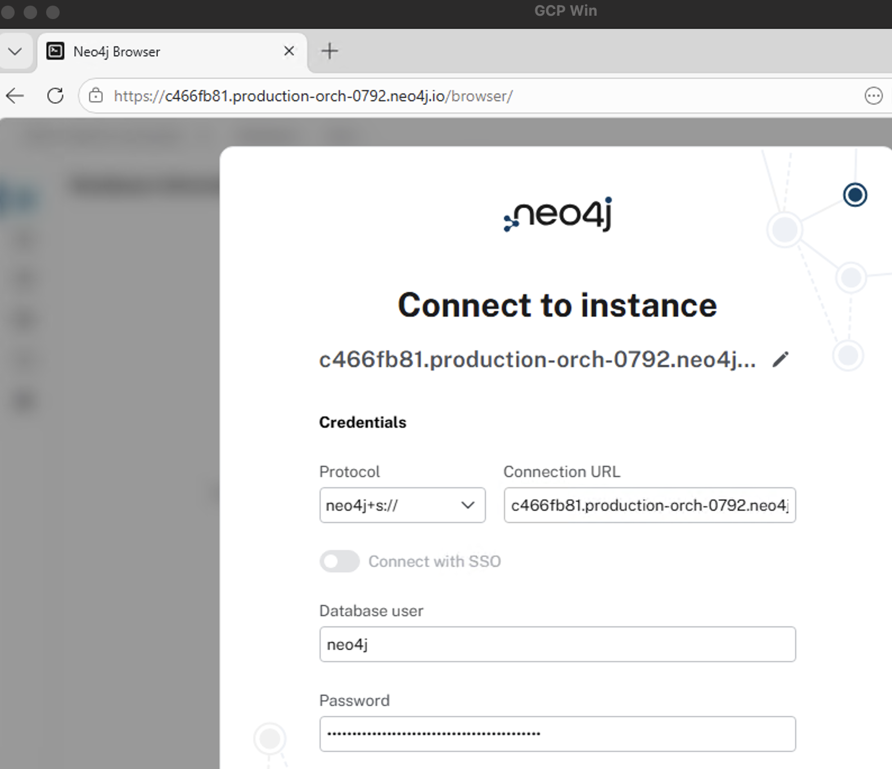

Use the **Private URI**, not the public one (`<dbid>.databases.neo4j.io`) —
the public URI resolves via public DNS and bypasses PSC.

Once connected, run:

```cypher
SHOW DATABASES YIELD name, address, role;
```

You should see the cluster's internal node addresses. These resolve
through the wildcard DNS rule (`*.production-orch-NNNN.neo4j.io.`) to
the PSC endpoint IP, confirming end-to-end routing traverses the private
backbone:


Every `p-<dbid>-<shard>.production-orch-NNNN.neo4j.io:7687` address
traffic flows through PSC, not the public internet.

---

## Step 10: Finish the Aura wizard (disable public traffic)

Now that the private path is validated (step 8, plus optionally
step 9), return to the Aura Console and reopen
**Project > Settings > Private endpoints**, which takes you back into
the same three-step wizard from step 2. Click through to
**Step 3 of 3**, check **Disable public traffic**, tick the VPN
acknowledgment, and click **Save**:


From this point on, every client on the internet will be refused and
the only way into the instance is through the PSC path you just
built.

If you flip **Disable public traffic** before step 8 passes, you lose
all access to the instance from anywhere outside the consumer VPC.
Re-enable it from the wizard to recover if that happens.

---

## Troubleshooting

| Symptom                                            | Likely cause and fix                                                                                            |
| -------------------------------------------------- | --------------------------------------------------------------------------------------------------------------- |
| `psc_connection_status` stuck on `PENDING`         | Consumer project ID mismatch in Aura's **Target GCP Project ID's** allowlist. Re-check step 2.2.                |
| DNS resolves to a public IP on the Windows VM      | Response policy not attached to the VM's VPC, or trailing dot missing on `dns_name`. The provided module handles both. |
| `Test-NetConnection` on 7687 fails, DNS is correct | Connection not yet `ACCEPTED`, or Premium Tier not enabled for a cross-region setup.                            |
| `terraform apply` fails on the forwarding rule     | Service attachment URI is wrong, region mismatched, or consumer project not yet on the Aura allowlist.          |
| RDP tunnel fails with `permission denied`          | Missing `roles/iap.tunnelResourceAccessor` on the user.                                                         |
| Lost access after disabling public traffic         | Reopen the Aura wizard, uncheck **Disable public traffic**, re-run step 8 to validate the private path, then re-enable.                                                          |
| Linux `validate.sh` reports `DNS FAIL` and DNS answer is blank | `getent` can't resolve. Check that the VM actually sits in the VPC the DNS response policy is attached to; re-apply if `create_network` was flipped between runs.               |
| Neo4j Browser: certificate hostname mismatch       | You connected to the public URI. Use the **Private URI** `<dbid>.production-orch-NNNN.neo4j.io`.                |
| GCP Connectivity Test returns Unreachable          | Check the forwarding rule status in the GCP Console, and verify the test's source VM is in the same VPC as the PSC endpoint. |

---

## Clean up

```bash
terraform destroy
```

The Aura side of the connection is not managed by Terraform. Remove the
consumer project from the Aura allowlist in the wizard (Step 2) to
finish tear-down.

---

## Reference

### Module layout

```
neo4j-aura-gcp-psc/
├── main.tf                      wires modules together
├── variables.tf                 root input variables
├── outputs.tf                   root outputs (including next_steps)
├── terraform.tfvars.example     copy to terraform.tfvars and fill in
├── modules/
│   ├── networking/              VPC + subnet + firewall, or data-source lookup
│   ├── psc_endpoint/            static IP + PSC forwarding rule
│   ├── dns/                     response policy + apex and wildcard A records
│   └── test_vm/                 Windows Server 2022 VM, Shielded VM
├── scripts/
│   ├── validate.ps1             run on the Windows VM to verify connectivity
│   └── iap_rdp.sh               start an IAP RDP tunnel to the test VM
├── prompts/                     design brief, iteration notes, final spec
└── screenshots/                 images referenced in this guide
```

### Ports

| Port | Purpose                        |
| ---- | ------------------------------ |
| 443  | HTTPS (Aura APIs, Browser UI)  |
| 7687 | Bolt (drivers)                 |
| 7474 | Browser HTTP listener          |
| 8491 | Graph Analytics (GDS)          |

### Design choices

- **Two DNS rules (apex + wildcard).** The Aura public docs specify a
  wildcard; the in-console instructions use the apex. Cloud DNS response
  policy rules do not perform subtree matching, so we create both.
- **Reuse the default VPC by default.** Simpler blast radius for a first
  deployment. For production, set `create_network = true` and tighten
  firewall rules.
- **Static internal IP for the PSC endpoint.** The IP is the DNS answer;
  reserving it keeps the DNS record stable across forwarding rule
  recreations.
- **Shielded VM on the test instance.** Secure boot, vTPM, and integrity
  monitoring are on by default.
- **`enable_test_vm` and `enable_vm_public_ip` flags.** Keep the test
  surface out of production, and force IAP-only access where needed.

### Related docs

- [Neo4j Aura: Secure Connections](https://neo4j.com/docs/aura/security/secure-connections/)
- [GCP: Access published services through Private Service Connect](https://cloud.google.com/vpc/docs/configure-private-service-connect-services)
- [GCP: Cloud DNS response policies](https://cloud.google.com/dns/docs/zones/manage-response-policies)
- [GCP: Connectivity Tests](https://cloud.google.com/network-intelligence-center/docs/connectivity-tests/overview)
