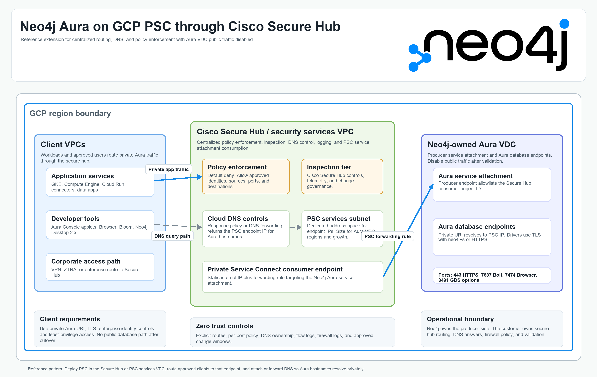

# Cisco Secure Hub extension for Neo4j Aura on GCP PSC

This extension describes how to use the Terraform in this repository when
customer workloads do not connect directly from an application VPC to the Neo4j
Aura Private Service Connect (PSC) endpoint. Instead, traffic is routed through
a customer-managed Cisco Secure Hub or equivalent security services VPC that
performs centralized inspection, policy enforcement, DNS control, and routing.

The repository still manages the same consumer-side GCP primitives:

- Static internal IP for the PSC consumer endpoint.
- PSC forwarding rule that targets the Neo4j Aura service attachment.
- Cloud DNS response policy rules for the Aura orchestrator hostname and
  wildcard database hostnames.

It does not provision Cisco Secure Hub, third-party inspection appliances, NCC
hubs/spokes, Cloud Interconnect, Cloud VPN, or enterprise identity controls.
Those are platform-owned controls that must already exist or be deployed by the
customer networking team.



The Neo4j logo used in the diagram is copied from the supplied
`Neo4j-logo_color.png` asset without modification and placed in the diagram at
its native pixel dimensions.

## When to use this pattern

Use this pattern when one or more of the following are true:

- Application VPCs route egress through a centralized Cisco Secure Hub,
  security services VPC, Network Connectivity Center (NCC) hub, or equivalent
  third-party transit layer.
- Public traffic is disabled on Aura VDC, so database access must use the
  private Aura endpoint.
- Developers need Neo4j tools such as Query, Browser, Bloom, or Neo4j Desktop,
  but database traffic must remain private.
- The customer wants a single, auditable path where DNS, routing, firewall
  policy, logging, and inspection are controlled centrally.

Do not use this pattern as a shortcut around application segmentation. If the
Secure Hub cannot provide route propagation to the PSC endpoint IP and a
deterministic return path, deploy a PSC endpoint in each application VPC
instead.

## Target architecture

The recommended target state has four boundaries:

| Boundary | Owner | Responsibility |
| --- | --- | --- |
| Aura producer side | Neo4j | Aura VDC, GCP PSC service attachment, database endpoints, TLS enforcement, Aura network access approval |
| Secure Hub / PSC services VPC | Customer platform networking | PSC endpoint, PSC services subnet, Cloud DNS response policy, route advertisement, inspection policy, centralized logs |
| Application and developer VPCs | Customer application/platform teams | Workload egress policy, DNS forwarding or peering, route import, identity controls, developer access |
| Corporate access path | Customer security/networking | VPN, ZTNA, or enterprise private access path into the Secure Hub before reaching the PSC endpoint |

Traffic flow:

1. A workload or approved developer resolves the Aura private URI, for example
   `<dbid>.production-orch-0792.neo4j.io`.
2. The originating VPC receives a private DNS answer: the static internal IP of
   the PSC endpoint in the Secure Hub or PSC services VPC.
3. Routing sends only approved traffic for that endpoint to the Secure Hub path.
4. Secure Hub policy permits the approved source, identity context, destination,
   and port.
5. The PSC forwarding rule sends traffic to the Neo4j Aura service attachment
   over Google's private network.
6. Aura serves database and tool traffic over the private endpoint. Public Aura
   database traffic can then remain disabled.

## Preferred deployment models

### Model A: Central PSC services VPC with NCC PSC propagation

This is the preferred model when the customer already uses NCC or can enable it.
Deploy this repository into a common services VPC that is connected to an NCC
hub with PSC connection propagation enabled. GCP can then propagate PSC consumer
endpoints from the common services VPC to VPC spokes in the same hub.

Use this model when:

- The Secure Hub or services VPC is already the approved routing boundary.
- Application VPCs are NCC VPC spokes.
- The platform team wants to avoid duplicating one PSC endpoint per VPC.
- The PSC endpoint subnet can be explicitly included or excluded from export as
  part of the NCC spoke design.

Important constraints:

- PSC connection propagation is specific to NCC VPC spokes. Do not assume plain
  VPC peering, vendor overlay routing, or default routes make PSC endpoints
  transitively reachable.
- Propagation can be asynchronous. Build validation into the cutover plan.
- If on-premises or developer networks reach GCP through hybrid spokes, confirm
  the NCC routing VPC requirements and route tables before disabling public
  traffic in Aura.

### Model B: Secure Hub VPC as the direct consumer VPC

Deploy this repository into the Secure Hub project and VPC. Application VPCs,
developer networks, and corporate access paths must route to the PSC endpoint
IP through the Secure Hub by using the customer's supported routing mechanism.

Use this model when:

- The customer product called "Secure Hub" owns the GCP VPC where centralized
  inspection happens.
- The customer can prove routing from every source network to the PSC endpoint
  IP and back.
- DNS can be centrally controlled or forwarded to the Secure Hub resolver path.

This model is common for third-party network virtual appliance designs, but the
route propagation and return path are customer-specific. Validate the data path
with GCP Connectivity Tests and live client tests before cutover.

### Model C: Per-VPC PSC endpoints

Deploy one PSC endpoint per application VPC when hub transit is not supported,
not approved, or not deterministic. This has more Terraform runs and more DNS
rules, but it is operationally clear and avoids depending on transitive routing.

Use this model when:

- An application VPC cannot import the PSC endpoint route.
- The Secure Hub is only an inspection path and does not support PSC endpoint
  propagation.
- Regulatory boundaries require isolation between application environments.

## Terraform configuration

Start from the example in
[`examples/cisco-secure-hub/terraform.tfvars.example`](../examples/cisco-secure-hub/terraform.tfvars.example).
The key difference from the base README is that `consumer_project_id`,
`existing_network_name`, and `existing_subnet_name` normally describe the
Secure Hub or PSC services VPC, not the application VPC.

```hcl
consumer_project_id = "customer-secure-hub-prod"
consumer_region     = "us-east4"
consumer_zone       = "us-east4-a"

create_network        = false
existing_network_name = "cisco-secure-hub-vpc"
existing_subnet_name  = "psc-services-us-east4"

neo4j_service_attachment = "https://www.googleapis.com/compute/v1/projects/<neo4j-producer-project>/regions/us-east4/serviceAttachments/<aura-service-attachment>"
neo4j_orch_dns_name      = "production-orch-NNNN.neo4j.io"

psc_ip_name       = "neo4j-aura-prod-us-east4-psc-ip"
psc_endpoint_name = "neo4j-aura-prod-us-east4-psc-endpoint"

allow_psc_global_access = true
```

`allow_psc_global_access` is optional and remains `false` by default. Enable it
only when clients in other regions of the same VPC need to reach the regional
PSC endpoint and the producer service supports global access. This setting does
not replace NCC propagation, DNS forwarding, or cross-VPC routing.

## Aura-side setup

In the Aura network access wizard:

1. Add the GCP project ID that will own the PSC forwarding rule. For the hub
   pattern, this is usually the Secure Hub or common services project, not the
   application project.
2. Copy the service attachment URL and DNS name from the Aura wizard.
3. Do not disable public traffic until all private path validation passes.
4. After validation, return to the wizard and disable public traffic.

For multi-region Aura VDC deployments, repeat the process per Aura region and
use separate PSC endpoint names, static IP names, DNS rule names, and labels.

## DNS design

The originator of the DNS query must receive the PSC endpoint IP as the answer
for both:

- The Aura orchestrator DNS name, for example
  `production-orch-0792.neo4j.io`.
- The wildcard database hostnames, for example
  `*.production-orch-0792.neo4j.io`.

Recommended options:

| Option | When to use | Notes |
| --- | --- | --- |
| Cloud DNS response policy in each workload VPC | Small number of VPCs or strict isolation | Duplicate the apex and wildcard rules in each VPC that originates queries. |
| DNS peering or forwarding to a central resolver path | Centralized platform DNS | The central resolver must return the PSC endpoint IP and must be reachable from the querying VPC. |
| NCC plus central DNS operations | Large hub-and-spoke estates | Pair PSC propagation with an explicit DNS pattern. PSC route reachability alone does not solve hostname resolution. |

Avoid split-brain DNS. The same client must not sometimes resolve the Aura URI
to the public endpoint and sometimes to the private PSC endpoint. During
migration, lower TTLs and test from every source environment before cutover.

## Secure Hub routing and policy

Route only the required destination, not broad internet ranges:

- Destination: the static PSC endpoint IP or the small PSC services subnet.
- Ports: `443`, `7687`, `7474`, and `8491` only if Graph Analytics is required.
- Sources: approved workload CIDRs, service accounts, developer access CIDRs, or
  identity-aware access groups as enforced by the customer's Secure Hub stack.

Recommended policy controls:

- Default deny for egress to the PSC services subnet.
- Separate rules for application runtime, CI/CD, and developer tools.
- Firewall and inspection logs enabled on every allow rule.
- VPC Flow Logs enabled for the PSC services subnet and application subnets.
- Change control for DNS response policy changes and Aura public-traffic
  disablement.
- Alerting on PSC connection status changes, unexpected DNS answers, and denied
  traffic on required ports.

Do not NAT traffic toward the PSC endpoint unless the customer's routing design
explicitly requires it and the return path is validated. NAT can hide workload
identity, complicate policy, and break propagated PSC designs.

## Developer tools with public traffic disabled

The customer document "Developer Tools w Aura VDC" makes an important
distinction: tool delivery and database connectivity are not the same thing.

Supported developer access patterns:

| Tool path | How it works | Required private path |
| --- | --- | --- |
| Aura Console at `https://console.neo4j.io` | Browser downloads the Aura web app. Query and Explore run locally in the browser. | Database calls from the browser must reach the Aura private URI through Secure Hub. |
| Browser and Bloom served by the database endpoint | Browser connects directly to the Aura endpoint over the private path. | HTTPS or database-native tool traffic to the private endpoint, commonly `443` and/or `7474`, with DNS resolving to the PSC endpoint IP. |
| Neo4j Desktop 2.x | Desktop runs locally after enterprise-approved installation. | Database calls from Desktop must use the private Aura URI over the Secure Hub path. |

Security recommendations:

- Publish internal instructions that tell developers to use the private Aura URI,
  not a public URI.
- If Neo4j Desktop is used, host the installer in an internal software catalog
  after normal enterprise scanning.
- Require SSO/MFA for Aura Console and enterprise device posture controls for
  developer access into the Secure Hub path.
- Keep database credentials and Aura API credentials out of Terraform variables,
  screenshots, tickets, and runbooks.

## Validation plan

Run validation in this order:

1. `terraform apply` completes and outputs the PSC endpoint IP.
2. `psc_connection_status` is `ACCEPTED`.
3. From the Secure Hub or services VPC, GCP Connectivity Tests show the PSC
   forwarding rule is reachable on `443`, `7687`, and `7474` if database-native
   tools are required.
4. From each application VPC or NCC spoke, DNS resolves the Aura private URI to
   the PSC endpoint IP.
5. From each application VPC or NCC spoke, routing reaches the PSC endpoint IP
   on required ports.
6. A Neo4j driver connects with `neo4j+s://<dbid>.<orch>.neo4j.io:7687`.
7. Browser or Query reaches the private endpoint over HTTPS if developer tool
   access is required.
8. Public traffic is disabled in Aura.
9. The same tests are repeated after public traffic is disabled.

Example client checks:

```bash
nslookup <dbid>.production-orch-NNNN.neo4j.io
nc -vz <dbid>.production-orch-NNNN.neo4j.io 7687
nc -vz <dbid>.production-orch-NNNN.neo4j.io 443
nc -vz <dbid>.production-orch-NNNN.neo4j.io 7474
```

If port `7687` is not allowed by the customer's security policy, confirm whether
the driver and tool path can use Aura HTTPS connectivity on `443` for the target
workflow.

## Production hardening checklist

- Use a dedicated PSC services subnet with non-overlapping CIDR space.
- Size the subnet for current Aura VDC regions, future regions, and parallel
  non-prod/prod endpoints.
- Keep prod and non-prod endpoints in separate projects, VPCs, subnets, DNS rule
  names, or at minimum separate labels and change controls.
- Store Terraform state in a controlled backend with encryption, versioning, and
  least-privilege IAM.
- Use service account impersonation for Terraform rather than broad user
  credentials.
- Enable organization policy and IAM Conditions where applicable.
- Keep `terraform.tfvars` out of Git. Use the checked-in example only as a
  template.
- Run code review for every route, firewall, DNS, and PSC endpoint change.
- Use Connectivity Tests and live client tests before and after disabling public
  traffic.
- Document ownership: Neo4j owns the producer side; the customer owns routing,
  DNS, inspection policy, logs, and client access.

## Troubleshooting

| Symptom | Likely cause | Fix |
| --- | --- | --- |
| `psc_connection_status` remains `PENDING` | Aura allowlist contains the wrong project ID | Add the project that owns the PSC forwarding rule in Aura and re-check. |
| DNS returns public Aura addresses | Response policy or forwarding path is not applied to the querying VPC | Attach the policy to that VPC or forward the Aura zone to the central resolver. |
| App VPC cannot reach the PSC endpoint IP | PSC endpoint route is not propagated or imported | Use NCC PSC propagation, vendor-supported routing, or deploy a local endpoint. |
| Connectivity works in Secure Hub but not from a spoke | Missing spoke route, DNS mismatch, or policy deny | Compare route tables, DNS answers, and Secure Hub logs for the source. |
| Developer tools load but queries fail | Tool app loaded from the internet, but browser-to-database path is blocked | Validate private URI DNS, port `443` or `7687`, and Secure Hub egress policy from the developer path. |
| Access breaks after disabling public traffic | Private path was not validated from every source | Temporarily re-enable public traffic in Aura, fix DNS/routing, retest, then disable again. |

## References

- [Neo4j Aura secure connections](https://neo4j.com/docs/aura/security/secure-connections/)
- [GCP Private Service Connect: access published services through endpoints](https://cloud.google.com/vpc/docs/configure-private-service-connect-services)
- [GCP Private Service Connect endpoint global access](https://cloud.google.com/vpc/docs/about-accessing-vpc-hosted-services-endpoints)
- [GCP Private Service Connect connection propagation through NCC](https://docs.cloud.google.com/network-connectivity/docs/network-connectivity-center/concepts/psc-propagated-connection-overview)
- [GCP Cloud DNS response policies](https://cloud.google.com/dns/docs/zones/manage-response-policies)
- [GCP Connectivity Tests overview](https://cloud.google.com/network-intelligence-center/docs/connectivity-tests/concepts/overview)
